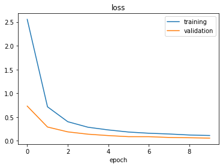
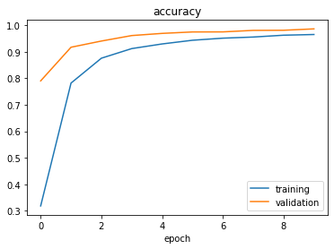

# Traffic-Sign-Classifier

View the notebook online: 
[](https://nbviewer.jupyter.org/github/mihaijulien/Traffic-Sign-Classifier/tree/master/)

Guided project of the following course: [Autonomous Cars: Deep Learning and Computer Vision in Python ](https://www.udemy.com/course/applied-deep-learningtm-the-complete-self-driving-car-course/)

The goal of the project was to build a model to clasiffy traffic signs.
The steps of the project consisted of:
- Importing the dataset already split into training, validation and testing set
- Preprocessing the images
- Build a neural network using the LeNet model architecture
```python
def leNet_model():
    model = Sequential()
    model.add(Conv2D(30, kernel_size=(5,5), input_shape=(32,32,1), activation='relu'))
    model.add(MaxPooling2D(pool_size=(2,2)))
    model.add(Conv2D(15, kernel_size=(3,3), activation='relu'))
    model.add(MaxPooling2D(pool_size=(2,2)))

    model.add(Flatten())
    model.add(Dense(500, activation='relu'))
    model.add(Dropout(0.5))
    model.add(Dense(num_classes, activation='softmax'))
    #Compile model
    model.compile(Adam(lr = 0.1), loss = "categorical_crossentropy", metrics = ['accuracy'])
    return model
```
- Train and validate the network with a training and validation set
- Increase the accuracy and prevent the model from overfitting by modifying the model as following:
  - Decrease the learning rate in optimizer (lr = 0.001)
  - Increase the number of filters in the convolutional layers (double them)
  - Adding extra convolutional layers
  - Adding one more Droput layer

```python
def modified_model():
    model = Sequential()
    model.add(Conv2D(60, kernel_size=(5,5), input_shape=(32,32,1), activation='relu'))
    model.add(Conv2D(60, kernel_size=(5,5), activation='relu'))
    model.add(MaxPooling2D(pool_size=(2,2)))

    model.add(Conv2D(30, kernel_size=(3,3), activation='relu'))
    model.add(Conv2D(30, kernel_size=(3,3), activation='relu'))
    model.add(MaxPooling2D(pool_size=(2,2)))
    model.add(Dropout(0.5))

    model.add(Flatten())
    model.add(Dense(500, activation='relu'))
    model.add(Dropout(0.5))
    model.add(Dense(num_classes, activation='softmax'))
    #Compile model
    model.compile(Adam(lr = 0.001), loss = "categorical_crossentropy", metrics = ['accuracy'])
    return model
```

After fine-tuning the model, the loss and accuracy ended up as:




